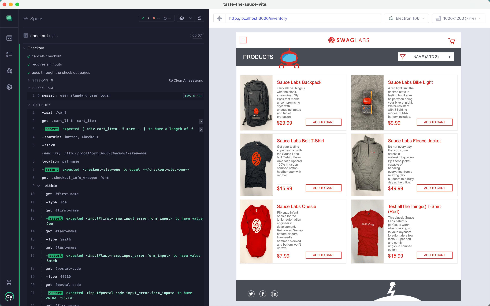

# taste-the-sauce-vite

> Cypress testing tutorial using Vite for the SauceLabs sample web app

🎓 See [Testing The Swag Store](https://cypress.tips/courses/swag-store) course

## See also

- Looking for Create-React-App version of this application? Check out [bahmutov/taste-the-sauce](https://github.com/bahmutov/taste-the-sauce)
- Moving from Create React App to Vite following this [article](https://sankalan.hashnode.dev/migrate-your-create-react-app-to-vite-easily)

## Small print

Author: Gleb Bahmutov &lt;gleb.bahmutov@gmail.com&gt; &copy; 2023

- [@bahmutov](https://twitter.com/bahmutov)
- [glebbahmutov.com](https://glebbahmutov.com)
- [blog](https://glebbahmutov.com/blog)
- [videos](https://www.youtube.com/glebbahmutov)
- [presentations](https://slides.com/bahmutov)
- [cypress.tips](https://cypress.tips)
- [Cypress Tips & Tricks Newsletter](https://cypresstips.substack.com/)
- [my Cypress courses](https://cypress.tips/courses)

License: MIT - do anything with the code, but don't blame me if it does not work.
